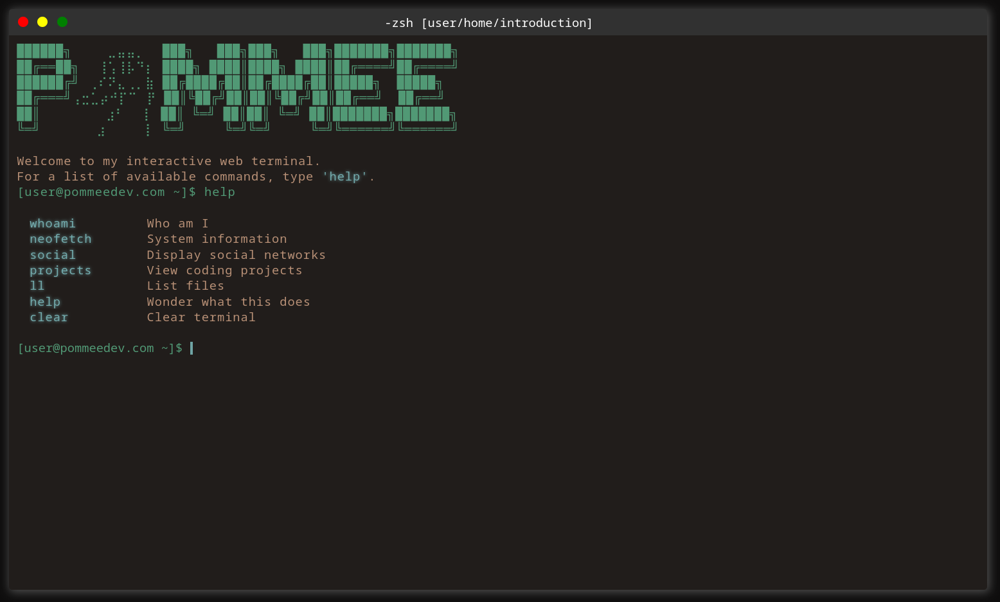

> Terminal based "portfolio".  

Website: https://github.com/pommee/pommeedev

I love to configure terminal emulators and mess around.  
However... I have never "loved" front-end development.  
Therefore, this was a fun way of forcing myself to do just that.

### Thanks to...

ForrestKnight [[link]](https://www.youtube.com/@fknight) for giving inspiration.

